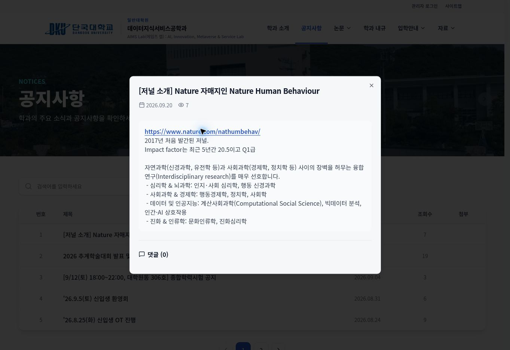

# 2026-09-30 공지 자동 링크·초기 화면 수정 검증

- 변경 PR: https://github.com/thinkpa81/dankook_graduate/pull/28
- 운영 반영 커밋: `a4e2549ccaca8c37c4f4c0e3f71adcaff17cc806`
- main CI: https://github.com/thinkpa81/dankook_graduate/actions/runs/36663036821
- PR CI: https://github.com/thinkpa81/dankook_graduate/actions/runs/36662967915

## 확인 결과

1. 타입 검사, 콘텐츠 링크 회귀검사, 기존 보안·SEO 검사, 운영 빌드, high 이상 의존성 감사 모두 통과했다.
2. 운영 홈페이지의 JavaScript 자산이 로컬 검증 빌드와 같은 `index-Duwwlxq1.js`로 교체되었고 `reveal-seo-fallback` 초기 스타일이 실제 DOM에 포함되어 새 버전 반영을 확인했다.
3. `https://dankookaims.org/notices/13`의 기존 본문 주소가 실제 링크와 `(새 창)` 접근성 안내로 표시되었다. 본문을 재저장하지 않았다.
4. 해당 링크를 클릭해 새 탭의 `https://www.nature.com/nathumbehav/`와 페이지 제목 `Nature Human Behaviour`를 확인했다.
5. 홈페이지 루트 주소를 유지한 정상 화면을 확인했다. 초기 잠깐 보이는 문구의 원인은 서버 SEO fallback과 React 화면의 교체이며 별도 사이트 리다이렉트가 아니다.
6. 관리자 로그인이나 운영 게시물 수정·등록은 수행하지 않았다. 공지를 조회한 것에 따른 기존 조회수 증가는 정상 동작이다.

## 검증 범위

- 운영 브라우저 확인은 1363px 데스크톱 화면에서 수행했다.
- 로컬 테스트 서버는 클라우드 브라우저 URL 정책으로 접근할 수 없었고, 브라우저에 모바일 viewport 및 JavaScript 비활성 설정 기능이 노출되지 않아 모바일 실화면·강제 번들 실패·JS 비활성 시나리오는 이번 세션에서 실행하지 못했다.
- 긴 주소의 `overflow-wrap:anywhere`, 사진 설명 flex 자식의 `min-width:0`, 초기 8초 후 fallback 복구 및 JS 비활성 fallback 유지 조건은 구현과 독립 코드 검토로 확인했다. 이를 기기별 실측 검증으로 간주하지 않는다.
- 기존 multer의 moderate 취약점 1건은 별도 유지보수 항목이며 high 이상 감사 기준은 통과했다.

## 이후 게시 방법

공지·모집요강·사진 설명에 `https://example.com`, `www.example.com`, `example.com`을 그대로 입력하면 자동으로 링크가 된다. 주소 다음 문장은 공백이나 줄바꿈으로 분리한다. 기존 글에도 자동 적용되므로 주소를 HTML 태그로 감싸거나 재등록할 필요가 없다.
